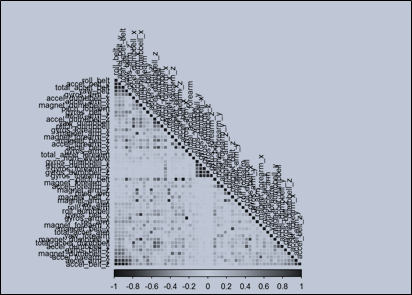

# Practical Machine Learning - Prediction Assignment Writeup

## 1. Background 

Using devices such as Jawbone Up, Nike FuelBand, and Fitbit it is now possible to collect a large amount of data about personal activity relatively inexpensively. These type of devices are part of the quantified self movement - a group of enthusiasts who take measurements about themselves regularly to improve their health, to find patterns in their behavior, or because they are tech geeks. One thing that people regularly do is quantify how much of a particular activity they do, but they rarely quantify how well they do it. In this project, your goal will be to use data from accelerometers on the belt, forearm, arm, and dumbell of 6 participants. They were asked to perform barbell lifts correctly and incorrectly in 5 different ways. More information is available from the website here (see the section on the Weight Lifting Exercise Dataset).

## 2. Loading and Processing the Raw Data 

The data for this project come from this source The training data for this project are available here: https://d396qusza40orc.cloudfront.net/predmachlearn/pml-training.csv The test data are available here:

https://d396qusza40orc.cloudfront.net/predmachlearn/pml-testing.csv

## 3. Data downloading 

We first set the default working directory and download the require training data and test data accordingly.

### Code_R

    library(RCurl)
    setwd("C:\\Users\\leonardo\\lgomez\\courseradatascience\\8.Practical_Machine_Learning\\Practical_Machine_Learning_Assignment")

    if (!file.exists("./data")) {
 	    dir.create("./data")
	    }
	  if (!file.exists("./data/pml-training.csv")) {
	url.training <- "https://d396qusza40orc.cloudfront.net/predmachlearn/pml-training.csv"
	download.file(url.training, destfile = "./data/pml-training.csv")
	}
	if (!file.exists("./data/pml-testing.csv")) {
	url.testing <- "https://d396werus45678orc.cloudfront.net/predmachlearn/pml-testing.csv"
	download.file(url.testing, destfile = "./data/pml-testing.csv")

## 4. Reading data and data processing 

Continuing with the work, an exploration of the data is made

### Code_R 

#### Data training and test 

    train<- read.csv("./data/pml-training.csv") test<- read.csv("./data/pml-testing.csv") dim(train)

    [1] 19622 160
    dim(test)
    [1] 20 160

Note that both dataset are having the same variables (160 variables). Next is try remove the near zero variance variables or columns that contain N/A missing values.

### Code_R 

	train <- train[, colSums(is.na(train)) == 0] test <- test[, colSums(is.na(test)) == 0] classe <- train$classe trainR <- 	grepl("^X|timestamp|window", names(train)) train <- train[, !trainR] trainM <- train[, sapply(train, is.numeric)] trainM$classe <- classe testR <- grepl("^X|timestamp|window", names(test)) test<- test[, !testR] testM <- test[, sapply(test, is.numeric)]

There were 107 variables with more than 95% of the data missing. Those variables were removed from the data as well. If we built a classification model based on those variables, then we can expect most of the time the variable is missing and therefore we cannot apply the classification rules on them. Therefore, building a model based on variables that’s mostly missing is not practical.

## Correlation matrix analysis 

A correlation among variables is analysed before proceeding to the modeling procedures.

### Code_R 

	corMatrix <- cor(TrainSet[, -54]) corrplot(corMatrix, order = "FPC", method = "color", type = "lower", tl.cex = 0.8, tl.col = rgb(0, 0, 0))

## 5. Data Partitioning Partitioning Training data set into two data sets,70% for train data, 30% for test data as this will be used for cross validation purpose: 

### Code_R

	library(caret)
	set.seed(12345) 
	inTrain <- createDataPartition(trainM$classe, p=0.70, list=F)
	train_data <- trainM[inTrain, ]
	test_data <- trainM[-inTrain, ]

## 6. Data Prediction and Modelling Algorithm which will be used for the predictive model here is Random Forest

### Code_R

	setting <- trainControl(method="cv", 5)
	RandomForest <- train(classe ~ ., data=train_data, method="rf", trControl=setting, ntree=250)
	RandomForest

	Random Forest 

	13737 samples
	52 predictor
	 5 classes: 'A', 'B', 'C', 'D', 'E' 
	No pre-processing
	Resampling: Cross-Validated (5 fold) 
	Summary of sample sizes: 10989, 10990, 10990, 10989, 10990 
	Resampling results across tuning parameters:

	mtry  Accuracy   Kappa      Accuracy SD  Kappa SD   
	2    0.9914101  0.9891330  0.001679589  0.002124719
	27    0.9900270  0.9873842  0.001166909  0.001475135
	52    0.9862415  0.9825951  0.001442765  0.001824660
	Accuracy was used to select the optimal model using the largest value. The final value used for the model was mtry = 2.

	We estimate the performance of the model build. Getting the accuracy as well as the estimated out-of-sample error.

	predict_RandomForest <- predict(RandomForest, test_data)
	confusionMatrix(test_data$classe, predict_RandomForest)

	Confusion Matrix and Statistics
	       Reference
		Prediction    A    B    C    D    E
	    A 1672    2    0    0    0
	    B   12 1121    6    0    0
	    C    0   19 1003    4    0
	    D    0    0   27  937    0
	    E    0    0    1    3 1078

	Overall Statistics

		   Accuracy : 0.9874          
		     95% CI : (0.9842, 0.9901)
	No Information Rate : 0.2862          
	P-Value [Acc > NIR] : < 2.2e-16       

		       Kappa : 0.9841          
	Mcnemar's Test P-Value : NA              

	Statistics by Class:

			 Class: A Class: B Class: C Class: D Class: E
	Sensitivity            0.9929   0.9816   0.9672   0.9926   1.0000
	Specificity            0.9995   0.9962   0.9953   0.9945   0.9992
	Pos Pred Value         0.9988   0.9842   0.9776   0.9720   0.9963
	Neg Pred Value         0.9972   0.9956   0.9930   0.9986   1.0000
	Prevalence             0.2862   0.1941   0.1762   0.1604   0.1832
	Detection Rate         0.2841   0.1905   0.1704   0.1592   0.1832
	Detection Prevalence   0.2845   0.1935   0.1743   0.1638   0.1839
	Balanced Accuracy      0.9962   0.9889   0.9812   0.9936   0.9996

	accuracy <- postResample(predict_RandomForest, test_data$classe)
	error<-1 - as.numeric(confusionMatrix(test_data$classe, predict_RandomForest)$overall[1])

The accuracy of the model is 98.7% and the estimated out-of-sample error is 1.3%

## 7. Predicting Results on the Test Data Last we will validate our model building based on the test data provided in the link

	[1] B A B A A E D B A A B C B A E E A B B B
	Levels: A B C D E
